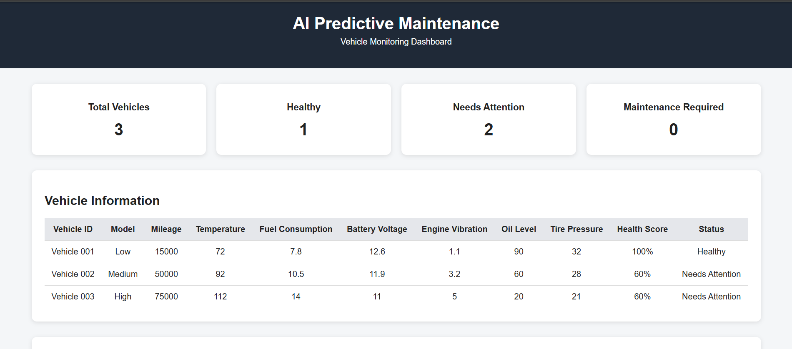
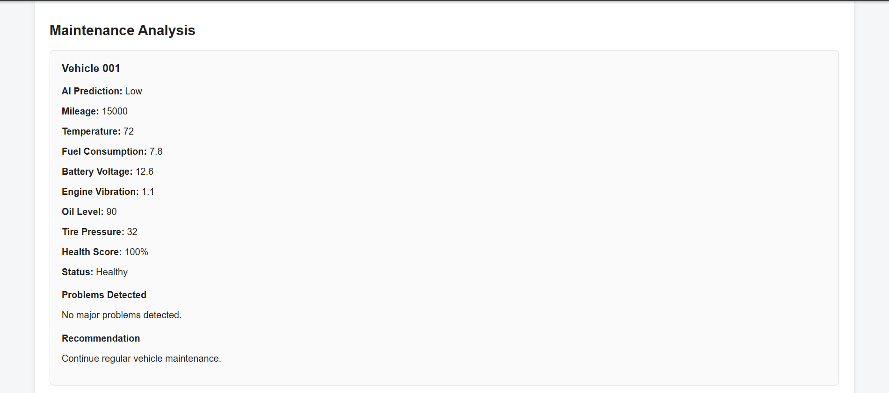
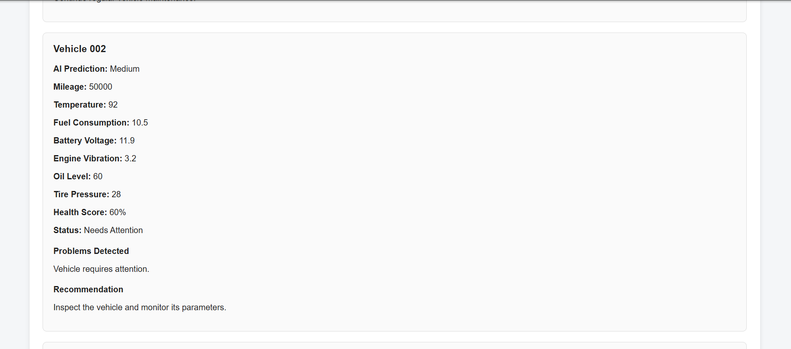
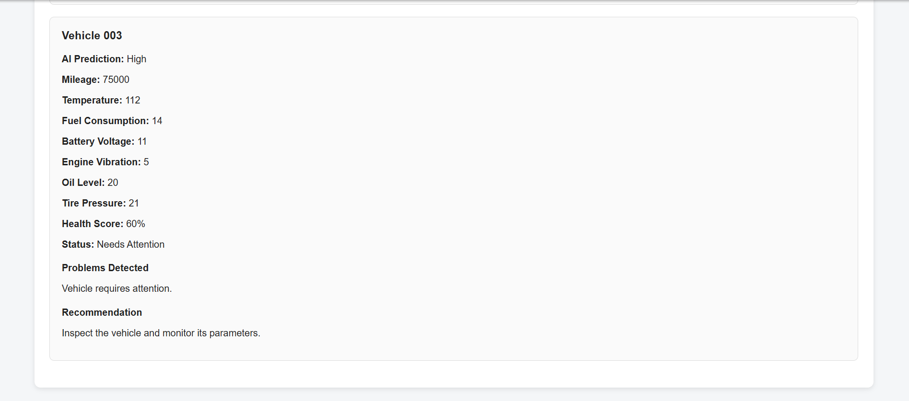

# AI Predictive Maintenance System

An AI-powered web application for monitoring vehicle health and predicting maintenance risk using machine learning.

## Project Overview

The system analyzes vehicle operational parameters and uses a Random Forest classification model to predict maintenance risk.

The prediction categories are:

- Low
- Medium
- High

## Key Features

- Vehicle health monitoring
- AI-based maintenance risk prediction
- Random Forest machine learning model
- Vehicle parameter monitoring
- Health score calculation
- Maintenance recommendations
- Flask REST API
- Interactive web dashboard

## Dashboard Preview


### Vehicle Data


### Vehicle Data


### Vehicle Data



## How the AI Model Works

The system uses a **Random Forest Classification model** to predict the maintenance risk of commercial vehicles based on their operational parameters.

### Prediction Workflow

1. **Vehicle Data Collection**
   The system receives vehicle parameters such as mileage, temperature, fuel consumption, battery voltage, engine vibration, oil level, and tire pressure.

2. **Data Processing**
   The collected data is processed using **Pandas** and prepared in the format required by the machine learning model.

3. **Model Training**
   A Random Forest Classification model is trained using historical vehicle data. The model learns patterns between vehicle operating conditions and their corresponding maintenance risk.

4. **Risk Prediction**
   When new vehicle data is provided, the trained model analyzes the input parameters and predicts the vehicle's maintenance risk.

5. **Risk Classification**
   The prediction is classified into one of three categories:

   * **Low** – Vehicle is operating under normal conditions.
   * **Medium** – Vehicle may require attention or monitoring.
   * **High** – Vehicle may require maintenance attention.

6. **Dashboard Display**
   The trained model is integrated with a **Flask REST API**, which provides the prediction to the web application. The JavaScript dashboard displays the vehicle information, health status, and predicted maintenance risk.

### AI Model Flow

**Vehicle Parameters → Data Processing → Random Forest Model → Risk Prediction → Flask API → Web Dashboard**

This approach helps transform vehicle operational data into an understandable maintenance-risk prediction for monitoring vehicle health.


## Machine Learning Features

The model uses seven vehicle parameters:

1. Mileage
2. Temperature
3. Fuel Consumption
4. Battery Voltage
5. Engine Vibration
6. Oil Level
7. Tire Pressure

## System Architecture

```text
Vehicle Data
     ↓
Pandas Data Processing
     ↓
Random Forest Model
     ↓
Trained Model
     ↓
Flask REST API
     ↓
JavaScript Dashboard
     ↓
Maintenance Risk Prediction
```

## Technology Stack

### Backend
- Python
- Flask
- Flask-CORS

### Machine Learning
- Pandas
- Scikit-learn
- Random Forest

### Frontend
- HTML
- CSS
- JavaScript

### API
- REST API


## Project Structure

```text
ai-predictive-maintenance/
│
├── backend/
│   ├── app.py
│   ├── app_backup.py
│   ├── predictive_model.pkl
│   └── train_model.py
│
├── data/
│   └── vehicle_data.csv
│
├── screenshots/
│   ├── dashboard.png
│   ├── vehicle-data.png
│   ├── vehicle-data1.png
│   └── vehicle-data2.png
│
├── static/
│   ├── script.js
│   └── style.css
│
├── templates/
│   └── index.html
│
├── .gitignore
├── README.md
└── requirements.txt
```
## Results

The AI Predictive Maintenance system successfully analyzes commercial vehicle sensor data and predicts the maintenance condition of each vehicle. The developed dashboard provides a clear view of vehicle health and AI-generated maintenance predictions.

### Key Results

- Real-time vehicle monitoring through an interactive dashboard.
- AI-based maintenance risk prediction using a trained Random Forest model.
- Vehicle conditions are classified into **Low, Medium, and High** maintenance risk.
- Displays important vehicle parameters such as **temperature, tire pressure, and vibration**.
- Provides an overall summary of **Total Vehicles, Healthy Vehicles, Vehicles Needing Attention, and Maintenance Required**.
- Integrates a **Flask backend, machine learning model, and web-based frontend**.
- Helps identify potential maintenance issues early and supports **preventive maintenance decisions**.

### Dashboard Result

The dashboard provides a visual representation of vehicle health status and AI predictions.


## How to Run

### 1. Clone the repository

```bash
git clone YOUR_GITHUB_REPOSITORY_URL
```

### 2. Create a virtual environment

```bash
python -m venv venv
```

### 3. Activate the virtual environment

**Windows:**

```bash
venv\Scripts\activate
```

### 4. Install dependencies

```bash
pip install -r requirements.txt
```

### 5. Train the model

```bash
cd backend
```

```bash
python train_model.py
```

### 6. Start Flask

```bash
python app.py
```

### 7. Open the dashboard

```text
http://127.0.0.1:5000
```


## Example Predictions

| Vehicle     | Temperature | Tire Pressure | Vibration | AI Prediction |
| ----------- | ----------: | ------------: | --------: | ------------- |
| Vehicle 001 |        72°C |        32 PSI |       2.1 | Low           |
| Vehicle 002 |        88°C |        27 PSI |       3.5 | Medium        |
| Vehicle 003 |        95°C |        24 PSI |       4.2 | High          |

## Demo Video

## Future Improvements

- Real-time IoT sensor integration
- Database integration
- Historical vehicle health tracking
- Predictive maintenance alerts
- Interactive charts
- Deployment to a cloud platform

## License

This project is licensed under the MIT License. See the [LICENSE](LICENSE) file for details.
